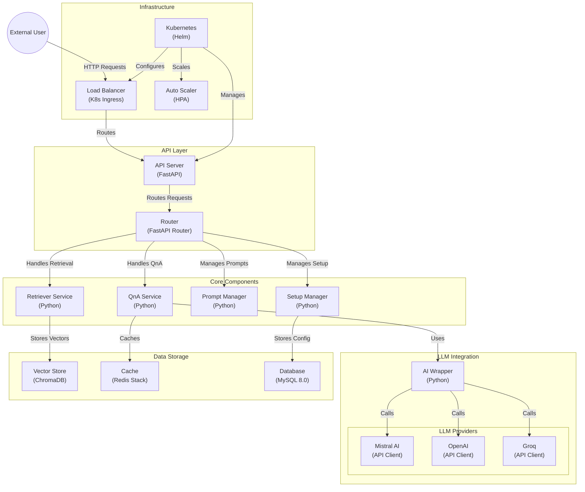

# OCHABOT GPT SEARCH
## Description
this project used on my profile page: [iank.me](https://iank.me).
Based on mistral AI, OpenAI, Groq, langchain and chroma vector database, I'm still learning, and this is my first project in AI

## Platform Support
### AI Platform
- OpenAI
- MistralAI
- Groq

### Embedding
- Huggingface
- Mistral
- Nvidia

## Requirements
### Databse
- Redis (LLM Cache and setup)
- Postgree (History)
- ChromaDB (Vector Database)

## How To Run
Running via poetry and activate virtualenvironment
```
poetry shell
```

## Install Requirement
```
poetry install
```

## Environment Setup
```
cp env.example .env
```
please setup APP_ENVIRONTMENT to local if you setup on development mode

## Running 
```
python main.py serve
```
with docker
```
docker compose up --build
```

## Migration
Using Alembic
```
alembic revision --autogenerate -m "Your Table"
```
run migration
```
alembic upgrade head
```

## Swagger
```
http://localhost:8081/docs
```

## Socket
url:
```
localhost:8081/ex/v1/chat/ws/{client_id}
```
payload:
```
{
    "chat": "hello",
    "collection": "ocha_v2",
    "llm": "openai", // optional
    "model": "gpt-4o-mini" // optional
}
```

## Structured Diagram
